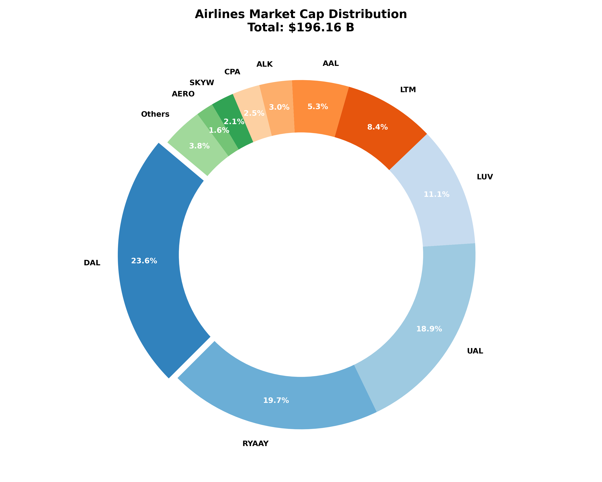

# Interactive Stock Market Intelligence Dashboard

A professional-grade, dynamic web application for stock market analysis and industry-specific financial reporting. This project integrates a high-performance **FastAPI** backend with a modern, glassmorphic **HTML5/JS** frontend to provide real-time insights into market trends, performance metrics, and valuation distributions.



## 🚀 Features

### 1. Dynamic Performance Analysis
- **Multi-Timeframe Tracking**: Instant toggle between 1D, 1M, 2M, 3M, 6M, 12M, and YTD performance.
- **Precision Calendar Logic**: Accurate percentage change calculations using robust calendar-based slicing (mirroring professional trading platforms).

### 2. Interactive Visualizations
- **Hover Sparklines**: Premium tooltips featuring high-resolution price trend charts.
- **Dynamic Chart Scaling**: Charts automatically zoom into the relevant price range for the selected timeframe, highlighting micro-movements.
- **Market Cap Distribution**: Interactive donut charts with professional unit scaling (Billions of USD) and industry aggregation.

### 3. Industrial-Strength Backend
- **FastAPI Integration**: Asynchronous, high-throughput API serving industry-specific financial data.
- **PostgreSQL Power**: Efficient SQL queries with optimized lookbacks (up to 2 years) and history buffers (1000 points).
- **Graceful Error Handling**: Robust detection of stale data or history gaps with user-facing diagnostic warnings.

## 🛠️ Tech Stack

- **Frontend**: HTML5, Vanilla CSS, jQuery, DataTables, ApexCharts.
- **Backend**: Python 3.9+, FastAPI, SQLAlchemy, Pandas, Uvicorn.
- **Database**: PostgreSQL (Relational Market Data).
- **Design**: Premium Glassmorphic aesthetic with Inter & Noto Sans TC typography.

## 📂 Project Structure

```text
├── api.py                  # Main FastAPI backend logic
├── Airlines_Report.html     # Dynamic Interactive Frontend
├── market_data_db.py       # SQL Alchemy database layer
├── market_data_fetcher.py   # Stock data ingestion & processing
├── schema.sql              # PostgreSQL database structure
├── .env                    # Environment configuration (DB credentials)
└── US_Stocks_Classified.xlsx # Ticker classification metadata
```

## ⚙️ Setup & Installation

### 1. Prerequisites
- Python 3.9+
- PostgreSQL Server
- Ticker data populated (using `market_data_fetcher.py`)

### 2. Configure Environment
Create a `.env` file in the root directory:
```env
DB_HOST=your_host
DB_NAME=your_db_name
DB_USER=your_user
DB_PASSWORD=your_password
DB_PORT=5432
```

### 3. Install Dependencies
```bash
pip install fastapi sqlalchemy pandas psycopg2 uvicorn openpyxl
```

### 4. Running the Application
1. **Start the API Server**:
   ```bash
   python api.py
   ```
2. **Open the Report**:
   Open `Airlines_Report.html` in any modern web browser.

---

## 🔍 Accuracy & Precision
This project prioritizes data integrity. The backend uses `pd.DateOffset` for precise monthly comparisons, while the frontend implements a robust, timezone-agnostic numeric calendar subtraction to ensure that table percentages and hover charts are always perfectly synchronized.
